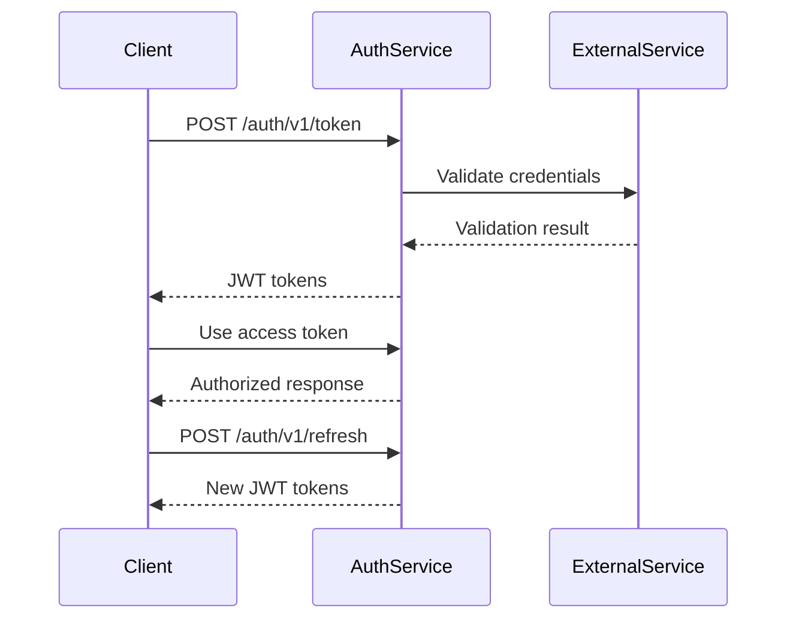

# Maliev Authentication Service

A secure, production-ready authentication service built with ASP.NET Core 9.0. Provides JWT token-based authentication for customers and employees with advanced security features including rate limiting, caching, input validation, and comprehensive observability.

[](https://dotnet.microsoft.com/)
[](LICENSE)
[](https://github.com/your-repo/actions)

## 🚀 Key Features

### Security & Authentication
- **JWT Token Authentication** - Secure token-based authentication with configurable expiration
- **Dual User Types** - Support for Customer and Employee authentication
- **Input Validation & Sanitization** - Prevents SQL injection, XSS, and other attacks
- **Rate Limiting** - Configurable per-endpoint rate limiting with sliding window algorithm
- **HTTPS Enforcement** - Production-ready SSL/TLS configuration

### Performance & Scalability  
- **Validation Caching** - Reduces external service calls by up to 80%
- **Connection Pooling** - Efficient HTTP client management
- **Asynchronous Operations** - Non-blocking I/O for better throughput
- **Database Optimization** - PostgreSQL with Entity Framework Core

### Observability & Monitoring
- **Structured Logging** - Serilog with correlation ID tracking
- **Custom Metrics** - Performance and business metrics collection
- **Health Checks** - Kubernetes-ready liveness and readiness probes
- **Distributed Tracing** - Request correlation across services

### Configuration & Deployment
- **Environment-based Configuration** - Development, testing, and production settings
- **Docker Support** - Container-ready with multi-stage builds
- **Kubernetes Ready** - Health checks and configuration management
- **API Versioning** - URL-based versioning for backward compatibility

## 📋 Prerequisites

- **.NET 9.0 SDK** - [Download here](https://dotnet.microsoft.com/download/dotnet/9.0)
- **PostgreSQL 13+** - For production database
- **Docker** (optional) - For containerized deployment
- **Kubernetes** (optional) - For production deployment

## 🏁 Quick Start

### 1. Clone and Build

```bash
git clone https://github.com/your-repo/Maliev.AuthService.git
cd Maliev.AuthService
dotnet build
```

### 2. Configure Settings

Create `appsettings.Development.json` (never commit this file):

```json
{
  "ConnectionStrings": {
    "RefreshTokenDbContext": "Host=localhost;Database=MalievAuth;Username=your_user;Password=your_password"
  },
  "Jwt": {
    "Issuer": "https://localhost:5001",
    "Audience": "maliev-auth-service", 
    "SecurityKey": "your-super-secret-key-that-is-at-least-256-bits-long-for-security"
  },
  "CustomerService": {
    "ValidationEndpoint": "https://customer-service.example.com/validate"
  },
  "EmployeeService": {
    "ValidationEndpoint": "https://employee-service.example.com/validate"
  }
}
```

### 3. Run Database Migrations

```bash
cd Maliev.AuthService.Api
dotnet ef database update
```

### 4. Start the Service

```bash
dotnet run
```

The API will be available at:
- **HTTP**: `http://localhost:5000`
- **HTTPS**: `https://localhost:5001`
- **Swagger UI**: `https://localhost:5001/auth/swagger`

## 🔧 Configuration

### Environment Variables

| Variable | Description | Default |
|----------|-------------|---------|
| `ASPNETCORE_ENVIRONMENT` | Environment (Development/Production) | Development |
| `ConnectionStrings__RefreshTokenDbContext` | Database connection string | In-memory (Testing) |
| `Jwt__SecurityKey` | JWT signing key | Required |
| `Jwt__Issuer` | JWT issuer | Required |
| `Jwt__Audience` | JWT audience | Required |

### Configuration Files

- **`appsettings.json`** - Base configuration
- **`appsettings.{Environment}.json`** - Environment-specific settings
- **`secrets.yaml`** - Sensitive configuration (optional)
- **Kubernetes ConfigMaps** - Production configuration

### Rate Limiting Configuration

```json
{
  "RateLimit": {
    "TokenEndpoint": {
      "PermitLimit": 10,
      "Window": "00:01:00",
      "QueueLimit": 5
    },
    "RefreshEndpoint": {
      "PermitLimit": 20, 
      "Window": "00:01:00",
      "QueueLimit": 10
    },
    "Global": {
      "PermitLimit": 100,
      "Window": "00:01:00",
      "QueueLimit": 20
    }
  }
}
```

### Cache Configuration

```json
{
  "Cache": {
    "ValidationCache": {
      "Enabled": true,
      "ExpirationTime": "00:05:00",
      "SlidingExpirationTime": "00:02:00", 
      "MaxCacheSize": 1000
    }
  }
}
```

## 🐳 Docker Deployment

### Build Image

```bash
docker build -t maliev-auth-service:latest .
```

### Run Container

```bash
docker run -d \
  --name maliev-auth \
  -p 8080:8080 \
  -e ASPNETCORE_ENVIRONMENT=Production \
  -e ConnectionStrings__RefreshTokenDbContext="Host=postgres;Database=MalievAuth;Username=user;Password=pass" \
  -e Jwt__SecurityKey="your-production-secret-key" \
  -e Jwt__Issuer="https://api.maliev.com" \
  -e Jwt__Audience="maliev-services" \
  maliev-auth-service:latest
```

### Docker Compose

```yaml
version: '3.8'

services:
  auth-service:
    build: .
    ports:
      - "8080:8080"
    environment:
      - ASPNETCORE_ENVIRONMENT=Production
      - ConnectionStrings__RefreshTokenDbContext=Host=postgres;Database=MalievAuth;Username=authuser;Password=authpass
      - Jwt__SecurityKey=your-production-secret-key
      - Jwt__Issuer=https://api.maliev.com
      - Jwt__Audience=maliev-services
    depends_on:
      - postgres

  postgres:
    image: postgres:15
    environment:
      - POSTGRES_DB=MalievAuth
      - POSTGRES_USER=authuser
      - POSTGRES_PASSWORD=authpass
    volumes:
      - postgres_data:/var/lib/postgresql/data
    ports:
      - "5432:5432"

volumes:
  postgres_data:
```

## ☸️ Kubernetes Deployment

### Deployment Manifest

```yaml
apiVersion: apps/v1
kind: Deployment
metadata:
  name: maliev-auth-service
  labels:
    app: maliev-auth-service
spec:
  replicas: 3
  selector:
    matchLabels:
      app: maliev-auth-service
  template:
    metadata:
      labels:
        app: maliev-auth-service
    spec:
      containers:
      - name: auth-service
        image: maliev-auth-service:latest
        ports:
        - containerPort: 8080
        env:
        - name: ASPNETCORE_ENVIRONMENT
          value: "Production"
        - name: ConnectionStrings__RefreshTokenDbContext
          valueFrom:
            secretKeyRef:
              name: auth-db-secret
              key: connection-string
        - name: Jwt__SecurityKey
          valueFrom:
            secretKeyRef:
              name: jwt-secret
              key: security-key
        - name: Jwt__Issuer
          value: "https://api.maliev.com"
        - name: Jwt__Audience
          value: "maliev-services"
        livenessProbe:
          httpGet:
            path: /auth/liveness
            port: 8080
          initialDelaySeconds: 30
          periodSeconds: 10
        readinessProbe:
          httpGet:
            path: /auth/readiness
            port: 8080
          initialDelaySeconds: 5
          periodSeconds: 5
        resources:
          requests:
            memory: "256Mi"
            cpu: "250m"
          limits:
            memory: "512Mi"
            cpu: "500m"
```

### Service and Ingress

```yaml
---
apiVersion: v1
kind: Service
metadata:
  name: maliev-auth-service
spec:
  selector:
    app: maliev-auth-service
  ports:
    - protocol: TCP
      port: 80
      targetPort: 8080
  type: ClusterIP

---
apiVersion: networking.k8s.io/v1
kind: Ingress
metadata:
  name: maliev-auth-ingress
  annotations:
    kubernetes.io/ingress.class: nginx
    cert-manager.io/cluster-issuer: letsencrypt-prod
    nginx.ingress.kubernetes.io/rate-limit: "100"
spec:
  tls:
  - hosts:
    - api.maliev.com
    secretName: maliev-auth-tls
  rules:
  - host: api.maliev.com
    http:
      paths:
      - path: /auth
        pathType: Prefix
        backend:
          service:
            name: maliev-auth-service
            port:
              number: 80
```

## 🧪 Testing

### Unit Tests

```bash
# Run all tests
dotnet test

# Run with coverage
dotnet test --collect:"XPlat Code Coverage"

# Run specific test category
dotnet test --filter Category=Unit
```

### Integration Tests

```bash
# Run integration tests
dotnet test --filter Category=Integration

# Run with test environment
ASPNETCORE_ENVIRONMENT=Testing dotnet test
```

### Load Testing

See [PERFORMANCE.md](PERFORMANCE.md) for detailed load testing guide.

```bash
# Simple load test with Apache Bench
ab -n 1000 -c 10 -p token-request.json -T application/json http://localhost:5000/auth/v1/token
```

## 📊 Monitoring

### Health Checks

- **Liveness**: `GET /auth/liveness` - Service is running
- **Readiness**: `GET /auth/readiness` - Service is ready to handle requests

### Metrics

The service exposes custom metrics using .NET's built-in metrics:

- Authentication attempts/successes/failures
- Token refresh operations
- Rate limit hits
- Cache hit/miss rates
- External service call durations
- Request processing times

### Logging

Structured logging with Serilog:

```json
{
  "Timestamp": "2024-01-01T12:00:00.000Z",
  "Level": "Information",
  "CorrelationId": "req-12345",
  "SourceContext": "AuthenticationController", 
  "Message": "Authentication success recorded for user type: {UserType}",
  "Properties": {
    "UserType": "Customer"
  }
}
```

## 🔐 Security Considerations

### Production Security Checklist

- [ ] Use strong JWT signing keys (256+ bits)
- [ ] Enable HTTPS in production
- [ ] Configure appropriate rate limits
- [ ] Set secure cookie policies
- [ ] Implement proper CORS policies
- [ ] Use secrets management (not configuration files)
- [ ] Enable security headers
- [ ] Regular security updates
- [ ] Monitor for suspicious activity

### Security Features

- **Input Validation**: Prevents injection attacks
- **Rate Limiting**: Prevents brute force attacks  
- **HTTPS Enforcement**: Encrypts data in transit
- **Correlation IDs**: Enables security event tracking
- **Structured Logging**: Facilitates security monitoring

## 🛠️ Development

### Project Structure

```
Maliev.AuthService/
├── Maliev.AuthService.Api/          # Main API project
│   ├── Controllers/                 # API controllers
│   ├── Services/                    # Business logic services
│   ├── Models/                      # Data models and DTOs
│   ├── Data/                        # Entity Framework contexts
│   ├── HealthChecks/               # Custom health checks
│   └── Middleware/                  # Custom middleware
├── Maliev.AuthService.JwtToken/     # JWT token generation
├── Maliev.AuthService.Tests/        # Test project
└── Documentation/                   # Additional documentation
```

### Adding New Features

1. **Create Feature Branch**: `git checkout -b feature/new-feature`
2. **Implement Changes**: Follow existing patterns and conventions
3. **Add Tests**: Maintain test coverage above 80%
4. **Update Documentation**: Update relevant documentation files
5. **Submit Pull Request**: Include description and testing instructions

### Code Style

- Follow C# coding conventions
- Use async/await for I/O operations
- Implement proper error handling
- Include XML documentation for public APIs
- Use dependency injection for services

## 📚 API Documentation

### Interactive Documentation
- **Swagger UI**: Available at `/auth/swagger` in development
- **OpenAPI Spec**: Generated automatically from code

### Usage Examples
See [API_USAGE.md](API_USAGE.md) for comprehensive API usage examples and client libraries.

### Authentication Flow



## 🔧 Troubleshooting

### Common Issues

1. **Database Connection Errors**
   ```bash
   # Check connection string
   dotnet ef database update --connection "your-connection-string"
   ```

2. **JWT Token Issues**
   ```bash
   # Verify JWT configuration
   curl -X GET http://localhost:5000/auth/readiness
   ```

3. **Rate Limiting Problems**
   - Check rate limit configuration in appsettings.json
   - Monitor rate limit headers in responses
   - Implement client-side backoff strategies

4. **External Service Failures**
   - Check external service health
   - Review retry policies and timeouts
   - Monitor cache hit rates to reduce dependencies

### Logging and Diagnostics

Enable debug logging:

```json
{
  "Serilog": {
    "MinimumLevel": {
      "Default": "Debug"
    }
  }
}
```

Check correlation IDs in logs for request tracing:
```bash
grep "req-12345" logs/auth-service-*.txt
```

## 🤝 Contributing

1. Fork the repository
2. Create a feature branch (`git checkout -b feature/amazing-feature`)
3. Commit changes (`git commit -m 'Add amazing feature'`)
4. Push to branch (`git push origin feature/amazing-feature`)
5. Open a Pull Request

### Development Setup

```bash
# Clone repository
git clone https://github.com/your-repo/Maliev.AuthService.git
cd Maliev.AuthService

# Install dependencies
dotnet restore

# Run development setup
dotnet run --project Maliev.AuthService.Api

# Run tests
dotnet test
```

## 📄 License

This project is licensed under the MIT License - see the [LICENSE](LICENSE) file for details.

## 🔗 Related Documentation

- [API Usage Guide](API_USAGE.md) - Comprehensive API examples and client libraries
- [Performance Testing](PERFORMANCE.md) - Load testing and performance monitoring
- [Docker Deployment](Dockerfile) - Container deployment configuration
- [Kubernetes Manifests](k8s/) - Production Kubernetes deployment files

## 📞 Support

For questions, issues, or contributions:

- **Issues**: [GitHub Issues](https://github.com/your-repo/Maliev.AuthService/issues)
- **Discussions**: [GitHub Discussions](https://github.com/your-repo/Maliev.AuthService/discussions)
- **Documentation**: Check this README and related documentation files

---

Built with ❤️ using ASP.NET Core 9.0