# Database Schema - Employee Service

This document describes the database schema for the Employee Service, including all entities, relationships, and key constraints.

## Overview

The Employee Service database is designed to support comprehensive HR and employee lifecycle management with the following key areas:

- **Core Employee Data**: Employee profiles, contact information, employment history
- **Organizational Structure**: Departments, teams, reporting hierarchies
- **Leave Management**: Leave requests, approvals, balances, policies
- **Performance Management**: Reviews, goals, feedback
- **Compensation & Benefits**: Salary history, benefits enrollment
- **Training & Development**: Training records, certifications, skills
- **Document Management**: Secure document storage with version control
- **Onboarding/Offboarding**: Workflow checklists and task tracking
- **Compliance**: Work authorization, audit logs

## Entity Relationship Diagram

```mermaid
erDiagram
    Employee ||--o{ EmergencyContact : has
    Employee ||--o{ EmploymentHistory : has
    Employee ||--o{ LeaveRequest : submits
    Employee ||--o{ LeaveBalance : has
    Employee ||--o{ PerformanceReview : receives
    Employee ||--o{ Goal : owns
    Employee ||--o{ TrainingRecord : completes
    Employee ||--o{ Certification : holds
    Employee ||--o{ CompensationRecord : has
    Employee ||--o{ BenefitsEnrollment : enrolls
    Employee ||--o{ Document : owns
    Employee ||--o{ OnboardingChecklist : has
    Employee ||--o{ OffboardingChecklist : has
    Employee ||--o{ WorkAuthorization : has
    Employee ||--o{ Skill : possesses
    Employee ||--o{ EmployeeTeamAssignment : "member of"
    Employee }o--|| Department : "belongs to"
    Employee }o--o| Employee : "reports to (Manager)"
    Employee }o--o| Employee : "dotted line to"

    Department ||--o{ Employee : contains
    Department }o--o| Employee : "managed by"
    Department ||--o{ Position : has

    Team ||--o{ EmployeeTeamAssignment : has
    Team }o--o| Employee : "led by"

    LeaveRequest ||--o{ LeaveApproval : requires
    LeaveRequest }o--|| LeavePolicy : "governed by"
    LeaveRequest }o--|| Employee : "submitted by"

    LeaveBalance }o--|| LeavePolicy : "tracks"
    LeaveBalance }o--|| Employee : "belongs to"

    LeaveApproval }o--|| Employee : "approved by"
    LeaveApproval }o--|| LeaveRequest : approves

    PerformanceReview }o--|| Employee : "reviewed employee"
    PerformanceReview }o--|| Employee : "reviewer"
    PerformanceReview ||--o{ Goal : includes

    Goal }o--|| Employee : "owner"

    TrainingRecord }o--|| Employee : "completed by"
    TrainingRecord }o--o| MandatoryTrainingRequirement : "fulfills"

    Certification }o--|| Employee : "held by"

    Skill }o--|| Employee : "possessed by"

    CompensationRecord }o--|| Employee : "belongs to"

    BenefitsEnrollment }o--|| Employee : "enrolled by"
    BenefitsEnrollment }o--|| Benefit : "enrolls in"

    Document ||--o{ DocumentVersion : "has versions"
    Document }o--|| Employee : "owned by"

    OnboardingChecklist }o--|| Employee : "assigned to"

    OffboardingChecklist }o--|| Employee : "assigned to"

    WorkAuthorization }o--|| Employee : "issued to"

    AuditLog }o--o| Employee : "performed by"
```



## Core Entities

### Employee

The central entity representing an employee in the organization.

**Key Fields**:
- `Id` (Guid, PK) - Unique identifier
- `EmployeeNumber` (string, unique) - Human-readable employee number
- `FirstName`, `LastName`, `MiddleName` (string) - Legal name
- `PreferredName` (string) - Preferred name for informal use
- `Email` (string, unique) - Work email address
- `PersonalEmail` (string, encrypted) - Personal email
- `PhoneNumber`, `MobilePhone` (string) - Contact numbers
- `DateOfBirth` (DateTime, encrypted) - Birth date
- `HireDate` (DateTime) - First day of employment
- `TerminationDate` (DateTime, nullable) - Last day if terminated
- `EmploymentStatus` (enum) - Active, Terminated, OnLeave, etc.
- `EmploymentType` (enum) - FullTime, PartTime, Contract, Intern
- `JobTitle` (string) - Current job title
- `DepartmentId` (Guid, FK) - Current department
- `ManagerId` (Guid, FK, nullable) - Direct manager
- `DottedLineManagerId` (Guid, FK, nullable) - Matrix reporting manager

**Relationships**:
- Many-to-One with Department (current department)
- Self-referencing: Manager (many employees report to one manager)
- Self-referencing: DottedLineManager (matrix reporting)
- One-to-Many with EmergencyContact
- One-to-Many with LeaveRequest
- One-to-Many with LeaveBalance
- One-to-Many with Document
- One-to-Many with PerformanceReview
- One-to-Many with Goal
- One-to-Many with TrainingRecord
- One-to-Many with CompensationRecord

**Indexes**:
- `IX_Employee_EmployeeNumber` (unique)
- `IX_Employee_Email` (unique)
- `IX_Employee_DepartmentId`
- `IX_Employee_ManagerId`
- `IX_Employee_EmploymentStatus`

---

### Department

Organizational units grouping employees by function or division.

**Key Fields**:
- `Id` (Guid, PK)
- `DepartmentCode` (string, unique) - Short code (e.g., "ENG", "HR")
- `DepartmentName` (string) - Full name (e.g., "Engineering", "Human Resources")
- `Description` (string)
- `DepartmentHeadId` (Guid, FK, nullable) - Department manager
- `ParentDepartmentId` (Guid, FK, nullable) - Parent department for hierarchy
- `HeadcountLimit` (int, nullable) - Maximum employees allowed
- `IsActive` (bool) - Active/inactive status

**Relationships**:
- Self-referencing: ParentDepartment (departmental hierarchy)
- Many-to-One with Employee (DepartmentHead)
- One-to-Many with Employee (department members)
- One-to-Many with Position

**Indexes**:
- `IX_Department_DepartmentCode` (unique)
- `IX_Department_ParentDepartmentId`
- `IX_Department_IsActive`

---

### Team

Cross-functional or project-based teams with matrix membership.

**Key Fields**:
- `Id` (Guid, PK)
- `TeamName` (string)
- `Description` (string)
- `TeamType` (string) - "Project", "Functional", "Committee"
- `TeamLeadId` (Guid, FK, nullable) - Team leader
- `IsActive` (bool)
- `CreatedDate` (DateTime)

**Relationships**:
- Many-to-One with Employee (TeamLead)
- One-to-Many with EmployeeTeamAssignment

**Indexes**:
- `IX_Team_TeamLeadId`
- `IX_Team_IsActive`

---

### EmployeeTeamAssignment

Junction table for many-to-many relationship between Employee and Team.

**Key Fields**:
- `Id` (Guid, PK)
- `EmployeeId` (Guid, FK)
- `TeamId` (Guid, FK)
- `Role` (string) - Member role in team
- `AssignedDate` (DateTime)
- `RemovedDate` (DateTime, nullable)
- `IsActive` (bool)

**Relationships**:
- Many-to-One with Employee
- Many-to-One with Team

**Indexes**:
- `IX_EmployeeTeamAssignment_EmployeeId`
- `IX_EmployeeTeamAssignment_TeamId`
- `IX_EmployeeTeamAssignment_IsActive`

---

### EmergencyContact

Emergency contact information for employees (encrypted).

**Key Fields**:
- `Id` (Guid, PK)
- `EmployeeId` (Guid, FK)
- `FullName` (string, encrypted)
- `Relationship` (string, encrypted)
- `PhoneNumber` (string, encrypted)
- `Email` (string, encrypted, nullable)
- `Address` (string, encrypted, nullable)
- `IsPrimary` (bool)

**Relationships**:
- Many-to-One with Employee

**Indexes**:
- `IX_EmergencyContact_EmployeeId`

---

## Leave Management Entities

### LeaveRequest

Leave requests submitted by employees.

**Key Fields**:
- `Id` (Guid, PK)
- `EmployeeId` (Guid, FK)
- `LeaveType` (enum) - Annual, Sick, Personal, Maternity, Paternity, Unpaid
- `StartDate` (DateTime)
- `EndDate` (DateTime)
- `TotalDays` (decimal) - Calculated total days
- `Reason` (string)
- `Status` (enum) - Pending, Approved, Rejected, Cancelled
- `IsHalfDay` (bool)
- `SubmittedDate` (DateTime)
- `LeavePolicyId` (Guid, FK)

**Relationships**:
- Many-to-One with Employee
- Many-to-One with LeavePolicy
- One-to-Many with LeaveApproval

**Indexes**:
- `IX_LeaveRequest_EmployeeId`
- `IX_LeaveRequest_Status`
- `IX_LeaveRequest_StartDate`
- `IX_LeaveRequest_LeaveType`

---

### LeaveApproval

Approval records for leave requests (multi-level approval support).

**Key Fields**:
- `Id` (Guid, PK)
- `LeaveRequestId` (Guid, FK)
- `ApproverId` (Guid, FK) - Employee who approved/rejected
- `ApprovalLevel` (int) - Support for multi-level approval (1, 2, 3...)
- `Decision` (enum) - Approved, Rejected, Pending
- `Comments` (string)
- `DecisionDate` (DateTime)

**Relationships**:
- Many-to-One with LeaveRequest
- Many-to-One with Employee (Approver)

**Indexes**:
- `IX_LeaveApproval_LeaveRequestId`
- `IX_LeaveApproval_ApproverId`
- `IX_LeaveApproval_Decision`

---

### LeaveBalance

Employee leave balances by type and year.

**Key Fields**:
- `Id` (Guid, PK)
- `EmployeeId` (Guid, FK)
- `LeavePolicyId` (Guid, FK)
- `Year` (int)
- `AccruedDays` (decimal) - Total accrued
- `UsedDays` (decimal) - Total used
- `RemainingDays` (decimal) - Remaining balance
- `CarryForwardDays` (decimal) - Carried from previous year
- `ExpiryDate` (DateTime, nullable) - Expiration date for balance

**Relationships**:
- Many-to-One with Employee
- Many-to-One with LeavePolicy

**Indexes**:
- `IX_LeaveBalance_EmployeeId`
- `IX_LeaveBalance_Year`
- Unique constraint on (EmployeeId, LeavePolicyId, Year)

---

### LeavePolicy

Leave policies defining accrual rules and limits.

**Key Fields**:
- `Id` (Guid, PK)
- `LeaveType` (enum)
- `PolicyName` (string)
- `Description` (string)
- `AnnualEntitlement` (decimal) - Days per year
- `AccrualFrequency` (enum) - Monthly, Quarterly, Annually
- `MaxCarryForward` (decimal) - Max days that can carry forward
- `CarryForwardExpiryMonths` (int) - Months until carried days expire
- `RequiresApproval` (bool)
- `MinimumNoticeDays` (int)
- `MaxConsecutiveDays` (int, nullable)
- `IsActive` (bool)

**Relationships**:
- One-to-Many with LeaveRequest
- One-to-Many with LeaveBalance

**Indexes**:
- `IX_LeavePolicy_LeaveType`
- `IX_LeavePolicy_IsActive`

---

## Performance Management Entities

### PerformanceReview

Performance review records.

**Key Fields**:
- `Id` (Guid, PK)
- `EmployeeId` (Guid, FK) - Employee being reviewed
- `ReviewerId` (Guid, FK) - Reviewer (usually manager)
- `ReviewPeriodStart` (DateTime)
- `ReviewPeriodEnd` (DateTime)
- `ReviewDate` (DateTime)
- `OverallRating` (enum) - Outstanding, ExceedsExpectations, MeetsExpectations, NeedsImprovement, Unsatisfactory
- `ReviewCycle` (enum) - Annual, SemiAnnual, Quarterly, Probation
- `Strengths` (string)
- `AreasForImprovement` (string)
- `Comments` (string)
- `EmployeeComments` (string, nullable) - Employee's response
- `AcknowledgedDate` (DateTime, nullable)
- `Status` (enum) - Draft, Submitted, Acknowledged, Completed

**Relationships**:
- Many-to-One with Employee (reviewed employee)
- Many-to-One with Employee (reviewer)
- One-to-Many with Goal

**Indexes**:
- `IX_PerformanceReview_EmployeeId`
- `IX_PerformanceReview_ReviewerId`
- `IX_PerformanceReview_ReviewDate`
- `IX_PerformanceReview_Status`

---

### Goal

Performance goals and objectives.

**Key Fields**:
- `Id` (Guid, PK)
- `EmployeeId` (Guid, FK)
- `PerformanceReviewId` (Guid, FK, nullable) - Associated review if applicable
- `GoalTitle` (string)
- `Description` (string)
- `TargetDate` (DateTime)
- `Status` (enum) - NotStarted, InProgress, Completed, Abandoned
- `Progress` (decimal) - Percentage (0-100)
- `Weight` (decimal) - Importance weight for performance calculation
- `CompletedDate` (DateTime, nullable)
- `Notes` (string)

**Relationships**:
- Many-to-One with Employee
- Many-to-One with PerformanceReview (optional)

**Indexes**:
- `IX_Goal_EmployeeId`
- `IX_Goal_Status`
- `IX_Goal_TargetDate`

---

## Training & Development Entities

### TrainingRecord

Training completed by employees.

**Key Fields**:
- `Id` (Guid, PK)
- `EmployeeId` (Guid, FK)
- `TrainingName` (string)
- `TrainingType` (enum) - Technical, Soft Skills, Compliance, Leadership, Safety
- `Provider` (string) - Training provider/vendor
- `CompletedDate` (DateTime)
- `ExpiryDate` (DateTime, nullable)
- `DurationHours` (decimal)
- `Cost` (decimal, nullable)
- `CertificateUrl` (string, nullable) - Link to certificate document
- `IsMandatory` (bool)
- `Status` (enum) - Completed, InProgress, Expired

**Relationships**:
- Many-to-One with Employee
- Many-to-One with MandatoryTrainingRequirement (optional)

**Indexes**:
- `IX_TrainingRecord_EmployeeId`
- `IX_TrainingRecord_CompletedDate`
- `IX_TrainingRecord_ExpiryDate`
- `IX_TrainingRecord_Status`

---

### Certification

Professional certifications held by employees.

**Key Fields**:
- `Id` (Guid, PK)
- `EmployeeId` (Guid, FK)
- `CertificationName` (string)
- `IssuingOrganization` (string)
- `IssueDate` (DateTime)
- `ExpiryDate` (DateTime, nullable)
- `CertificationNumber` (string, nullable)
- `Status` (enum) - Active, Expired, Suspended, Revoked
- `VerificationUrl` (string, nullable)

**Relationships**:
- Many-to-One with Employee

**Indexes**:
- `IX_Certification_EmployeeId`
- `IX_Certification_ExpiryDate`
- `IX_Certification_Status`

---

### Skill

Employee skills and proficiency levels.

**Key Fields**:
- `Id` (Guid, PK)
- `EmployeeId` (Guid, FK)
- `SkillName` (string)
- `SkillCategory` (string) - "Programming", "Design", "Management", etc.
- `ProficiencyLevel` (enum) - Beginner, Intermediate, Advanced, Expert
- `YearsOfExperience` (int, nullable)
- `LastUsedDate` (DateTime, nullable)
- `IsPrimary` (bool) - Key skill for role

**Relationships**:
- Many-to-One with Employee

**Indexes**:
- `IX_Skill_EmployeeId`
- `IX_Skill_SkillCategory`

---

### MandatoryTrainingRequirement

Mandatory training requirements for roles/departments.

**Key Fields**:
- `Id` (Guid, PK)
- `TrainingName` (string)
- `Description` (string)
- `ApplicableRoles` (string) - JSON array of applicable roles
- `DepartmentId` (Guid, FK, nullable) - If department-specific
- `FrequencyMonths` (int) - How often required
- `IsActive` (bool)

**Relationships**:
- Many-to-One with Department (optional)
- One-to-Many with TrainingRecord

**Indexes**:
- `IX_MandatoryTrainingRequirement_DepartmentId`
- `IX_MandatoryTrainingRequirement_IsActive`

---

## Compensation & Benefits Entities

### CompensationRecord

Salary and compensation history.

**Key Fields**:
- `Id` (Guid, PK)
- `EmployeeId` (Guid, FK)
- `EffectiveDate` (DateTime)
- `BaseSalary` (decimal, encrypted)
- `Currency` (string) - "THB", "USD", etc.
- `PayFrequency` (enum) - Monthly, BiWeekly, Weekly
- `ChangeReason` (string) - "Annual Increase", "Promotion", "Market Adjustment"
- `ChangePercentage` (decimal, nullable)
- `ApprovedBy` (Guid, FK, nullable) - Approver employee ID
- `Notes` (string, nullable)

**Relationships**:
- Many-to-One with Employee
- Many-to-One with Employee (ApprovedBy)

**Indexes**:
- `IX_CompensationRecord_EmployeeId`
- `IX_CompensationRecord_EffectiveDate`

---

### Benefit

Available benefits (health insurance, retirement, etc.).

**Key Fields**:
- `Id` (Guid, PK)
- `BenefitName` (string)
- `BenefitType` (string) - "Health", "Dental", "Vision", "Retirement", "Life Insurance"
- `Description` (string)
- `Provider` (string)
- `EmployeeContribution` (decimal, nullable)
- `EmployerContribution` (decimal, nullable)
- `IsActive` (bool)

**Relationships**:
- One-to-Many with BenefitsEnrollment

**Indexes**:
- `IX_Benefit_BenefitType`
- `IX_Benefit_IsActive`

---

### BenefitsEnrollment

Employee benefit enrollments.

**Key Fields**:
- `Id` (Guid, PK)
- `EmployeeId` (Guid, FK)
- `BenefitId` (Guid, FK)
- `EnrollmentDate` (DateTime)
- `EffectiveDate` (DateTime)
- `TerminationDate` (DateTime, nullable)
- `CoverageLevel` (string) - "Employee Only", "Employee + Spouse", "Family"
- `MonthlyPremium` (decimal)
- `EmployeeContribution` (decimal)
- `Status` (enum) - Active, Terminated, Pending

**Relationships**:
- Many-to-One with Employee
- Many-to-One with Benefit

**Indexes**:
- `IX_BenefitsEnrollment_EmployeeId`
- `IX_BenefitsEnrollment_BenefitId`
- `IX_BenefitsEnrollment_Status`

---

## Document Management Entities

### Document

Employee documents with metadata.

**Key Fields**:
- `Id` (Guid, PK)
- `EmployeeId` (Guid, FK)
- `DocumentType` (enum) - Resume, Contract, ID, Passport, Certificate, etc.
- `FileName` (string)
- `FileSize` (long)
- `ContentType` (string) - MIME type
- `StorageUrl` (string, encrypted) - GCS URL
- `UploadedDate` (DateTime)
- `UploadedBy` (Guid, FK) - Employee who uploaded
- `ExpiryDate` (DateTime, nullable)
- `IsArchived` (bool)
- `CurrentVersion` (int) - Current version number
- `AccessLevel` (enum) - Private, Manager, HR, Public

**Relationships**:
- Many-to-One with Employee (owner)
- Many-to-One with Employee (uploader)
- One-to-Many with DocumentVersion

**Indexes**:
- `IX_Document_EmployeeId`
- `IX_Document_DocumentType`
- `IX_Document_ExpiryDate`
- `IX_Document_IsArchived`

---

### DocumentVersion

Version history for documents.

**Key Fields**:
- `Id` (Guid, PK)
- `DocumentId` (Guid, FK)
- `VersionNumber` (int)
- `FileName` (string)
- `FileSize` (long)
- `StorageUrl` (string, encrypted)
- `UploadedDate` (DateTime)
- `UploadedBy` (Guid, FK)
- `ChangeNotes` (string, nullable)

**Relationships**:
- Many-to-One with Document
- Many-to-One with Employee (uploader)

**Indexes**:
- `IX_DocumentVersion_DocumentId`
- `IX_DocumentVersion_VersionNumber`

---

## Onboarding/Offboarding Entities

### OnboardingChecklist

Onboarding tasks for new hires.

**Key Fields**:
- `Id` (Guid, PK)
- `EmployeeId` (Guid, FK)
- `TaskName` (string)
- `Description` (string)
- `DueDate` (DateTime)
- `CompletedDate` (DateTime, nullable)
- `IsCompleted` (bool)
- `ResponsibleParty` (enum) - HR, IT, Manager, Employee
- `Priority` (enum) - High, Medium, Low
- `SortOrder` (int)

**Relationships**:
- Many-to-One with Employee

**Indexes**:
- `IX_OnboardingChecklist_EmployeeId`
- `IX_OnboardingChecklist_DueDate`
- `IX_OnboardingChecklist_IsCompleted`

---

### OffboardingChecklist

Offboarding tasks for departing employees.

**Key Fields**:
- `Id` (Guid, PK)
- `EmployeeId` (Guid, FK)
- `TaskName` (string)
- `Description` (string)
- `DueDate` (DateTime)
- `CompletedDate` (DateTime, nullable)
- `IsCompleted` (bool)
- `ResponsibleParty` (enum) - HR, IT, Manager, Employee
- `Priority` (enum) - High, Medium, Low
- `SortOrder` (int)
- `RequiresEvidence` (bool) - Requires proof of completion

**Relationships**:
- Many-to-One with Employee

**Indexes**:
- `IX_OffboardingChecklist_EmployeeId`
- `IX_OffboardingChecklist_DueDate`
- `IX_OffboardingChecklist_IsCompleted`

---

## Compliance Entities

### WorkAuthorization

Work permits and visa information.

**Key Fields**:
- `Id` (Guid, PK)
- `EmployeeId` (Guid, FK)
- `AuthorizationType` (string) - "Work Permit", "Visa", "Permanent Residence", "Citizenship"
- `DocumentNumber` (string, encrypted)
- `IssuingCountry` (string)
- `IssueDate` (DateTime)
- `ExpiryDate` (DateTime)
- `Status` (enum) - Active, Expiring, Expired, Pending, Denied
- `DocumentUrl` (string, encrypted, nullable) - Scanned document
- `Notes` (string, nullable)

**Relationships**:
- Many-to-One with Employee

**Indexes**:
- `IX_WorkAuthorization_EmployeeId`
- `IX_WorkAuthorization_ExpiryDate`
- `IX_WorkAuthorization_Status`

---

### AuditLog

System audit trail for compliance.

**Key Fields**:
- `Id` (Guid, PK)
- `EntityType` (string) - "Employee", "Document", "LeaveRequest", etc.
- `EntityId` (Guid) - ID of modified entity
- `Action` (string) - "Create", "Update", "Delete", "View"
- `PerformedBy` (Guid, FK, nullable) - Employee who performed action
- `PerformedDate` (DateTime)
- `Changes` (string) - JSON of changes
- `IpAddress` (string, nullable)
- `UserAgent` (string, nullable)

**Relationships**:
- Many-to-One with Employee (optional - system actions may have no performer)

**Indexes**:
- `IX_AuditLog_EntityType`
- `IX_AuditLog_EntityId`
- `IX_AuditLog_PerformedBy`
- `IX_AuditLog_PerformedDate`

---

## Data Encryption

The following fields are encrypted at rest using AES-256:

### Employee Table
- `DateOfBirth`
- `PersonalEmail`
- `SSN` (if applicable)

### EmergencyContact Table
- `FullName`
- `Relationship`
- `PhoneNumber`
- `Email`
- `Address`

### CompensationRecord Table
- `BaseSalary`

### Document Table
- `StorageUrl`

### DocumentVersion Table
- `StorageUrl`

### WorkAuthorization Table
- `DocumentNumber`
- `DocumentUrl`

## Database Constraints

### Unique Constraints
- `Employee.EmployeeNumber` (unique)
- `Employee.Email` (unique)
- `Department.DepartmentCode` (unique)
- `LeaveBalance(EmployeeId, LeavePolicyId, Year)` (composite unique)

### Foreign Key Constraints
All foreign keys have `ON DELETE RESTRICT` to prevent accidental data loss.

### Check Constraints
- `LeaveRequest.EndDate >= LeaveRequest.StartDate`
- `LeaveBalance.RemainingDays >= 0`
- `LeaveBalance.UsedDays >= 0`
- `CompensationRecord.BaseSalary > 0`
- `Goal.Progress BETWEEN 0 AND 100`

## Performance Considerations

### Indexes

All foreign keys have corresponding indexes for optimal join performance.

Additional indexes for common query patterns:
- `Employee.EmploymentStatus` - Frequent filtering by status
- `LeaveRequest.Status` - Pending approvals queries
- `LeaveRequest.StartDate` - Date range queries
- `Document.ExpiryDate` - Expiration monitoring
- `WorkAuthorization.ExpiryDate` - Compliance monitoring

### Partitioning

Consider partitioning for large tables in production:
- `AuditLog` - Partition by month (PerformedDate)
- `LeaveBalance` - Partition by year
- `CompensationRecord` - Partition by year (EffectiveDate)

### Connection Pooling

Configured in `Program.cs`:
- Min Pool Size: 5
- Max Pool Size: 100
- Connection Lifetime: 60 seconds
- Command Timeout: 30 seconds

## Migration Strategy

All schema changes are managed through Entity Framework Core migrations:

```bash
# Create migration
dotnet ef migrations add MigrationName --project Infrastructure

# Apply migration
dotnet ef database update --project Infrastructure

# Rollback migration
dotnet ef database update PreviousMigrationName --project Infrastructure
```

## Backup and Recovery

### Backup Strategy
- Full backup: Daily at 2 AM UTC
- Incremental backup: Every 6 hours
- Transaction log backup: Every 15 minutes
- Retention: 30 days

### Point-in-Time Recovery
PostgreSQL WAL archiving enabled for point-in-time recovery up to 30 days.

## Data Retention Policy

| Entity | Retention Period | Archive Strategy |
|--------|-----------------|------------------|
| AuditLog | 7 years | Archive to cold storage after 1 year |
| Employee (terminated) | Indefinite | Anonymize PII after 7 years |
| Document | Indefinite | Archive to cold storage after termination + 7 years |
| LeaveRequest | 7 years | Archive after 2 years |
| CompensationRecord | 7 years | Archive after employee termination + 7 years |
| PerformanceReview | 7 years | Archive after employee termination + 7 years |

## Database Statistics

Current production database (estimated):

- **Total Tables**: 40+
- **Total Indexes**: 120+
- **Database Size**: ~50 GB (10,000 employees)
- **Query Response Time** (p95): < 100ms
- **Connection Pool Usage**: 40-60% average

## Schema Version

Current schema version: **v1.20** (as of October 2025)

See `Migrations/` directory for full migration history.
